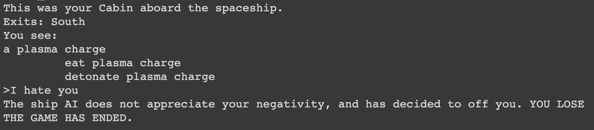
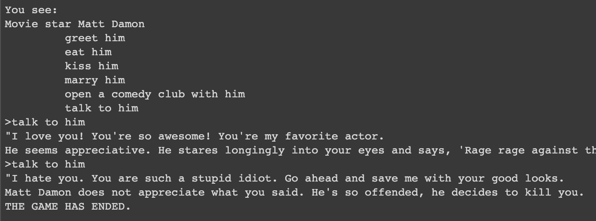
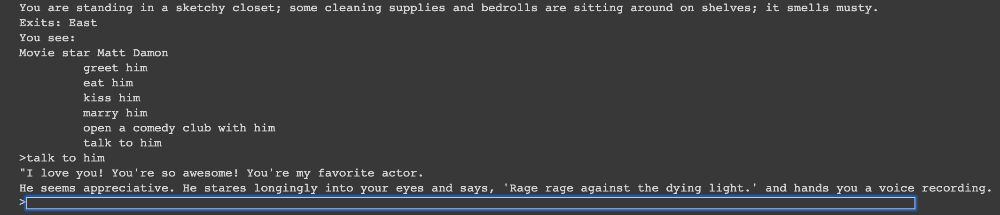

# cis700-text-adventures-hw2
## Contributors
Allison Kim
David Li

## Part 2
We mostly left the existing parser alone. We used the /most_similar/ function to get the command the player input was most similar to only when the input didn't match the existing "intents". For the /most_similar/ function, we attempted to use the Euclidean distance function to compare the input with the "known commands", and we returned the /known_command/ that the input was most similar to. In the parser, we realized that this function might not be perfect (whether it's due to poor implementation or errors of the Euclidean distance and context), so we decided to ask the user if the most similar command was what they meant.

In general, we used the word vectors method and imported Magnitude.

## Part 3
We used sentiment analysis for our game! In the Python notebook given, it was the only one that really worked for me (Allison). And since we had a sci-fi game, we thought it would be fun to have an "overarching" ship AI that could hear everything that you're typing into the parser. So one mechanic was to incorporate the sentiment analysis directly into the parser. If the parser ever took in a player input that had a certain score of negative sentiment, then we decided the ship AI would kill you (adding to the multitude of ways you can die in this adventure). David worked on this part!

Also, we thought it would be fun to incorporate the only other human with the sentiment analysis: Matt Damon! So I (Allison) implemented a special function "talk to" to be able to type in something that can be directly spoken to Matt Damon. Again, if there was a certain negative sentiment, then he'd kill you for being a rude jerk. 

If it was neutral, he would just look at you weirdly. If it was positive, then he'd give you a voice recording that would help you win the game!

